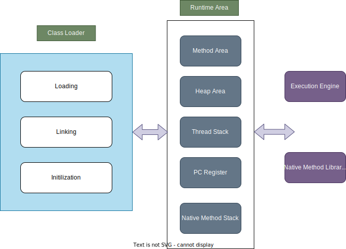
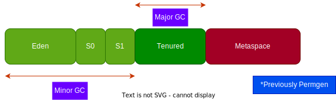

# What is JVM?

Java Virtual Machine is the cornerstone of Java Platform. It's an abstract computing machine which manipulates various memory areas at runtime.

JVM is the key pillar supporting languages like Java, Scala, Kotlin etc.. It's publicly designed but can have private implementation like HotSpot, openJDK, Azul, Adoptium etc.. 


# Architecture 




# Features

## Class Loader

* Loads the .class files into the memory and constructs a linkage between all the dependencies
* Performance verification of the dependencies
* It initializes class member entities like static variables and methods
* Manages the verification and preparation of the static fields.

```
private static final String DATE_FORMAT = "DD/MM/YYYY"
```

## Memory Area
* Method Area
    - Constant Pool, Field, method data and definitions for constructors and methods are stored
* Heap Area
    - All the objects and their instance variables are allocated and stored here
* Stack
    - Method's local variables and call stack
* PC Register
    - Address of the current JVM instruction
* Native Method Stack
    - Native methods written in C, C++ etc.. Example - Thread's Native Method
        ```private native void start0();```

## Java Memory Management




Objects are GCed based on TTL by the garbage collector and when no space is left on respective survivor space
The objects are moved from, Eden -> S0 -> S1 -> Old

- Young Generation
    * Eden, Survivor 1, Survivor 2 belongs to young generation
    * Cleaned up by the Minor GC
- Old Generation
    * Tenured space belongs to old generation
    * Cleaned up by Major GC
- Metaspace
    * Classes and metadata information about them. Code cache are also stored here
    * Before Java 8 it was called as Perm Gen


Garbage collector is responsible for the below three,
- Allocating Objects in memory
- Making sure it exists in memory
- De Allocation objects from memory

### Hotspot VM GC Types

- Young Generation
    - Serial GC : Stop the world, copying collectors and single GC thread
    - ParNew GC : Stop the world, copying collectors and multiple GC threads - It differs from Parallel in as it can be coupled with CMS gc
    - Parallel Scavenge : Stop the world, copying collectors and multiple GC threads

- Old Generation
    - Serial Old : Stop the world, Mark Sweep collector and single GC thread
    - Concurrent Mark Sweep : Concurrent, Low Pause
    - Parallel Old :  Compacting Collector, Multiple GC thread.
    - G1 GC : Both young and old but needs large heap memory

HotSpot allows you to pair up GC between young and old but only compatible GCs are allowed. CMS is deprecated in Java 9 and G1 has replaced it. 

### Common Memory Problems
    - Incorrect memory space configuration - Configuring G1 when heap allocated is less than 1gb
    - Memory Leaks
    - Excessive Use of Finalizer -
    - Explicit GC Invocations - Running GC invocations in a scheduled manner (System.gc())


### Frequently Used JVM Args
- -XX:MaxRAMPercentage
- -XX:+UseGCLogFileRotation -XX:NumberOfGCLogFiles=50 -XX:GCLogFileSize=10M -Xloggc:/logs/gc.log -XX:+PrintGCDetails  -XX:+PrintGCDateStamps -XX:+PrintGCTimeStamps -XX:+PrintTenuringDistribution -XX:+PrintGCApplicationStoppedTime 
- -XX:+HeapDumpOnOutOfMemoryError -XX:HeapDumpPath=/logs/heapdump.log 
- -Xms & -Xmx

## References
- https://docs.oracle.com/en/java/javase/20/vm/java-virtual-machine-technology-overview.html
- https://engineering.talkdesk.com/ninjas-guide-to-getting-started-with-visualvm-f8bff061f7e7
- https://www.digitalocean.com/community/tutorials/java-jvm-memory-model-memory-management-in-java
- https://codeahoy.com/2017/08/06/basics-of-java-garbage-collection/#:~:text=%E2%80%9CParallel%20Scavenge%E2%80%9D%20is%20a%20stop,make%20it%20usable%20with%20CMS.
- https://www.hboehm.info/gc/complexity.html#:~:text=All%20such%20reachable%20objects%20are,as%20they%20are%20being%20traversed.
- https://sematext.com/blog/java-memory-leaks/#:~:text=One%20of%20the%20simplest%20examples,never%20clear%20or%20throw%20away.
